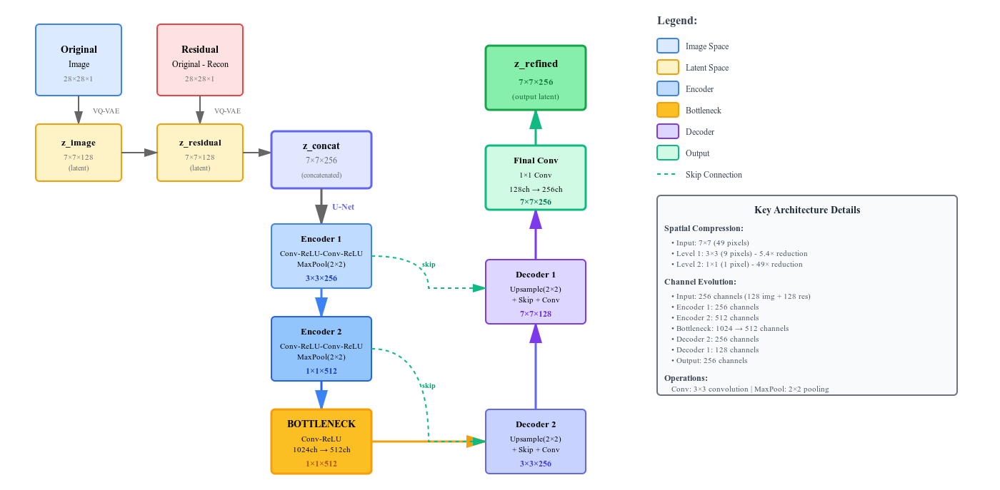

# CV Project: VAE residual Analysis

## Questions that we want to tackle: 
1. We want to see to what extent does residual between reconstruction and ground truth contains sufficient information to reconstruct the original image?
2. Can we train an encoder to reconstruct just based on the residual?
3. Are there any significant meanings that are represented in the residual? 

## Proposed Model 
The proposed model architecture is a hierarchical VAEs

